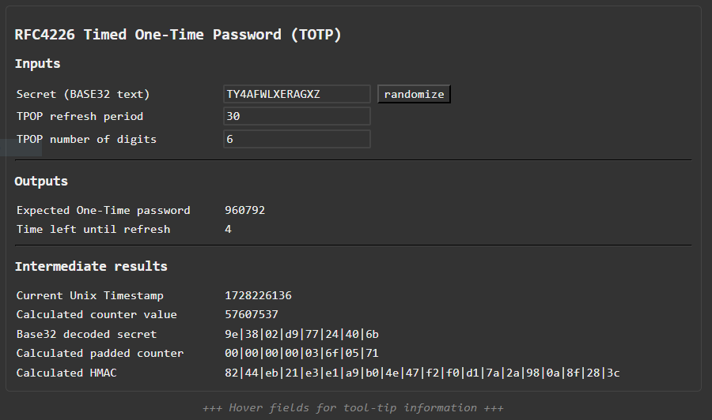

# HOTP/TOTP Calculation according to RFC4226

Example/Test implementation in JS to generate "Hashed One-Time Password" (HOTP)
/ "Timed One-Time Password" (TOTP).

*This repository is a an evaluation record how easy or hard the basic
principle of this two-factor authentication method is to implement - spoiler
alert: Not hard.*

Notes and additional information about the RFC4226 algorithm is located in
the code comments. The reference of RFC4226 can be found here:
https://www.ietf.org/rfc/rfc4226.txt

The implementation was checked against 2FAS and the "Microsoft Authenticator"
App on mobile platforms.

### Dependencies

  - `jsSHA` is used to calculate the SHA-1 HMAC data required by the
    HOTP/TOTP algorithms (for synchronous implementation, alternatively
    use `window.crypto.subtle` in `async` implementations or `Crypto`
    for nodejs). `jsSHA` is located at https://github.com/Caligatio/jsSHA.

### Files

  - `js/hotp.js` contains the actual implementation for One-time password
    calculation.

  - `js/index.js` contains the glue code to the HTML representation.

  - `js/sha.js` contains the `jsSHA` dependency.

  - `index.html` contains the HTML UI for the example.

### Build/Run Instructions

No build system is needed. Clone/download the repository and open the
`index.html` in your browser. It should run on all contemporary browsers
(tested with Chrome-like). The resulting HTML UI looks like:




### `HOTP` Object Usage

Invoke `HOTP.calculate()` using an argument object (named arguments). Either
specify a unix timestamp and a token refresh period (TOTP), or specify a
counter value (HOTP).

  ```js
    // HOTP
    const args = {
      num_htop_digits: 6,                 // The number of digits that the OTP shall have.
      secret_base32: "DBYIA4NT3T2RH4",    // BASE32 secret, !EXAMPLE DATA!
      htop_counter: 123456789,            // Numeric counter "challenge" value, !EXAMPLE DATA!
    }

    const otp = HOTP.calculate(args);
    const time_left = HOTP.timer(args);


    // TOTP
    const args = {
      num_htop_digits: 6,                 // The number of digits that the OTP shall have.
      secret_base32: "DBYIA4NT3T2RH4",    // BASE32 secret, !EXAMPLE DATA!
      token_period_s: 30                  // Refresh period
      unix_timestamp: Math.round(Date.now()/1000), // Time in seconds since start 1970.
    }

    const otp = HOTP.calculate(args);
    const time_left = HOTP.timer(args);
  ```

For intermediate result data inspection, the function `HOTP.calculate_otp_data()`
returns an object with the partial results of the process.

### Conclusion

Implementing HOTP or TOTP to harden my/your login process is not a hard thing.
The interesting part is more likely related to:

  - storing and handling the user secret securely on the server side
    (assuming that popular authenticator applications or plugins do this
    for the client side, too). Maybe a good approach is to establish a
    HMAC query to the internal user data storage module, providing the
    current padded counter byte stream. In this case, the secret is not
    disclosed directly from the storage to the frontend.

  - covering timing/clock differences between client and server, e.g. by
    accepting OTP values 30s (one counter tick) before and after the server
    time. (Login functional stability, user workflow).

  - covering acceptance delays for incorrect authentication to mitigate
    brute force attacks.

  - the "pairing" methodology, e.g. using QR code scanning with fallback to
    manual secret entry.

  - ensuring that the communication channel is actually secure (e.g. HTTPS
    with valid certificates only).

  - ensuring that leaking by the UI frontend implementation in case of
    bugs is mitigated (same as for the normal login data).

  - determining how many OTP digits are appropriate for the use case
    (manual data entry fault probability vs. OTP strength).

  - determining if 2FA should be entered directly with the login data (e.g.
    the user/password data), or as a second authentication step during login,
    or weather querying 2FA is only needed if more critical data shall be
    accessed. (User workflow, annoyances, etc).

--
